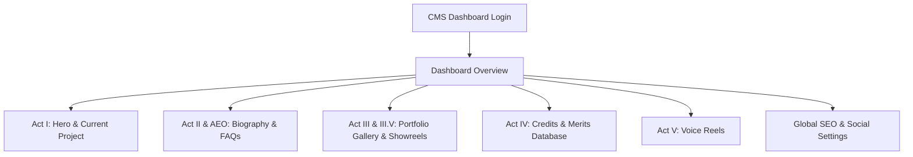

# Custom Portfolio CMS & SEO Implementation Plan

This document outlines the architecture, database schema, translation mechanics, and SEO integration plan for the custom Content Management System (CMS) of **theresejarvheden.se**. 

It is designed to be highly optimized for Google/AI-engine indexing (AEO/GEO) while remaining simple and intuitive for a non-technical user.

---

## 1. CMS Architecture & Data Persistence

To avoid conflicts with the Git-synced nature of the website (especially when building/syncing with platforms like Lovable), content will be stored in a cloud database rather than local JSON/Markdown files.

*   **Backend Database:** **Supabase (PostgreSQL)** — Free tier is perfect for this scale, offers instant REST/GraphQL APIs, built-in Authentication, and easy image storage buckets.
*   **CMS Interface:** Secure admin dashboard built directly into the site (under a protected route `/backstage`) using standard React components.
*   **Authentication:** Supabase GoTrue (Email/Password login) for Therese.
*   **Astro-Ready:** The database APIs will connect seamlessly to TanStack Start today and can be migrated to Astro's static site generation (SSG) or Server-Side Rendering (SSR) fetch loops tomorrow.

---

## 2. Bilingual Translation & Localization Strategy

Since the website is fully bilingual (Swedish & English), the CMS must make content translation effortless.

### Schema Design for Bilingual Data
Instead of duplicating entire records, database tables will store common metadata globally and provide dual-language text fields.

| Table | Field Name | Type | Translation Handling |
| :--- | :--- | :--- | :--- |
| **Biography** | `bio_main_quote_sv` / `_en` | Text | Localized |
| | `bio_body_text_sv` / `_en` | HTML/Rich Text | Localized |
| | `profile_base_sv` / `_en` | String | Localized (e.g., "Malmö / Stockholm") |
| | `dialects_sv` / `_en` | String | Localized (e.g., "Skånsk" vs "Scanian") |
| **Credits** | `year` | String | Shared (global) |
| | `project_title` | String | Shared (global) |
| | `role_sv` / `_en` | String | Localized (e.g., "Mamman" vs "The Mother") |
| | `category_sv` / `_en` | String | Localized |
| | `type` | Enum | Shared (Film, TV, Theater, Voice) |
| | `production_company` | String | Shared (global) |
| | `is_current_production` | Boolean | Shared (global) |
| | `commentary_url` | URL | Shared (global audio file) |
| | `commentary_text_sv` / `_en` | Text | Localized commentary transcript |
| **Showreels** | `video_url` | URL | Shared (global Vimeo/YouTube link) |
| | `thumbnail_url` | URL | Shared (global image) |
| | `category_sv` / `_en` | String | Localized (e.g., "Drama" / "Drama") |
| **Voice Reels**| `audio_url` | URL | Shared (global audio file) |
| | `title_sv` / `_en` | String | Localized (e.g., "Reklamröst" / "Commercial Voice") |

### Admin Translation Interface
To make translation easy for a non-technical user, the dashboard will implement:
1.  **Side-by-Side Editing Panel:** A layout where the Swedish input is on the left and the English input is on the right. This lets her translate in real-time without flipping pages.
2.  **Asset sharing:** She uploads an image/audio file once. The CMS automatically maps it to both Swedish and English pages.
3.  **One-Click Auto-Translation:** Integrate a light LLM or Google Translate API trigger in the CMS. When she finishes writing a bio paragraph in Swedish, she can click a button to auto-generate the English version, leaving her to only proofread.

---

## 3. Integrated, Simple SEO & AEO Automation

Therese is not technical, so the CMS must handle technical SEO and AI Search Engine Optimization (AEO/GEO) entirely under the hood.

### A. Live Google Search & Social Preview
A widget on the settings page dynamically draws a desktop/mobile Google Search card and an OpenGraph link card (like on Slack/Instagram) using her input.

```
+--------------------------------------------------------+
| Google Preview (Mobile)                               |
|                                                        |
| theresejarvheden.se                                    |
| Therese Järvheden — Skådespelerska & Röstskådespelare  |
| Svensk skådespelerska och röstskådespelare. Aktuell i  |
| SVT:s En våldsam kärlek. Skånsk dialekt...             |
+--------------------------------------------------------+
```

### B. Visual Length Guidance
Inputs for Page Titles and Meta Descriptions will have automatic character counters that change colors based on optimal lengths:
*   **SEO Title:** Max 60 chars (Green bar for 45–60, Red if exceeded).
*   **SEO Meta Description:** Max 160 chars (Green bar for 120–160, Red if exceeded).

### C. Automatic Asset Renaming & Alt Tags
*   **Auto-Sanitize Images:** When uploading an image, the CMS will automatically rename the file to a clean, search-friendly slug (e.g., `therese-jarvheden-actress-portrait-1.jpg`) instead of preserving camera filenames like `IMG_9145.jpg`.
*   **Enforced Image Alt-Texts:** The image upload window will block saving until a brief description (alt text) is entered, explicitly labeled: *"Describe this photo for Google Images (e.g., 'Therese Järvheden - headshot 2025')".*

### D. Automated Schema.org (JSON-LD) Generator
The CMS will automatically assemble inputs into structured schema markup in the page headers:
*   **Person Schema:** Compiles her name, agency links, IMDb, Wikipedia URLs, and dialects into a crawlable entity profile.
*   **VideoObject Schema:** Automatically generated for each Showreel item using Vimeo metadata.
*   **FAQPage Schema:** Automatically generated from a simple "FAQ Builder" section in the CMS, helping answer queries like *"What shows has Therese Järvheden been in?"* inside AI Overviews.

---

## 4. CMS Dashboard Sections & Features



### Act I Dashboard — Hero & Current Project
*   **Featured Production Text:** A text area to write what is current (e.g., *"En våldsam kärlek — SVT dramadokumentär"*).
*   **Automation Toggle:** A switch labeled *"Automate Current Production from Credits"*. If enabled, the CMS searches Act IV for the credit with the `is_current_production` flag active and auto-fills the Hero.

### Act II & AEO Dashboard — Biography & FAQ Builder
*   **Quote & Paragraph Editor:** Rich text fields for Swedish and English biographies.
*   **Quick Facts:** Tag lists for Dialects, Languages, and Locations.
*   **FAQ Builder:** A simple list manager where she can add Question/Answer pairs. This feeds the `FAQPage` schema to rank in Google FAQ accordions and AI search engines.

### Act III & III.V Dashboard — Gallery & Showreels
*   **Visual Grid Reordering:** A drag-and-drop interface allowing her to reorder her portfolio photos. The order indexes are saved directly to the database.
*   **Agency Download Flag:** A toggle on each photo to determine if casting directors see a "Download High-Res" button on the front page.
*   **Showreels Matrix:** Inputs for Video URLs (Vimeo/YouTube) with an option to upload custom thumbnails to maintain the site's dark cinematic styling.

### Act IV Dashboard — Credits & Merits
*   **Tabular CV Manager:** A grid table with columns for Year, Project Title, Role (SV/EN), Category, Production, and Action buttons.
*   **Current Production Toggle:** A checkbox to set the credit as active (powering Act I automation).
*   **Commentary Audio & Script Hooks:** Easy upload for mp3 audio commentary overlays and textareas for script dialogue snippets.

---

## 5. Implementation Roadmap

### Phase 1: Database Setup (Supabase)
1. Initialize a Supabase project.
2. Create tables: `profiles` (for Auth), `biography`, `credits`, `showreels`, `voice_reels`, and `seo_settings`.
3. Configure Storage Buckets for portfolio photos, audio reels, and showreel thumbnails.

### Phase 2: CMS Admin Interface (Access Route: `/backstage`)
1. Create the `/backstage` path inside the TanStack Router structure. *(Completed)*
2. Build the secure login form with access key validation. *(Completed)*
3. Design the dashboard layout with tabs matching the "Acts" structure. *(Completed)*
4. Implement side-by-side translation editors for SV and EN inputs. *(Completed)*
5. Add image upload and alt-tag configurations, along with character-validated inputs. *(Completed)*
6. Build tabular CV/Merit manager and Google Search Snippet/OpenGraph Preview card widgets. *(Completed)*

### Phase 3: SEO Integration & Live Snippet Mockups
1. Integrate character counters and the visual Google/Social card mockup on the SEO settings tab. *(Completed)*
2. Wire up automatic JSON-LD script generation on page load based on active database rows.

### Phase 4: Dynamic Frontend Connection
1. Replace the static `CREDITS` and `I18N` objects in `src/routes/index.tsx` with dynamic fetches from the database.
2. Add client-side caching or SSR preload queries to prevent layout shifts (CLS) and ensure fast Largest Contentful Paint (LCP) performance.

### Phase 5: Verification & Testing
1. Verify SEO schema structure using Google Rich Results Test tool.
2. Ensure that all page routes and SEO tags compile cleanly under 400 lines of code per component. *(Completed)*