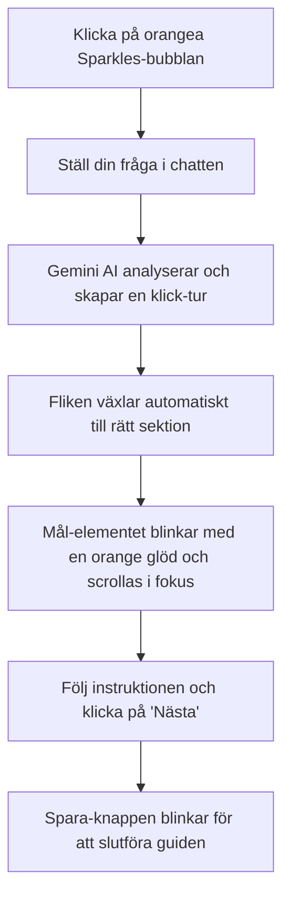

# Backstage CMS — Användar- & Testmanual

Välkommen till **Backstage CMS** manualen för [theresejarvheden.se](https://theresejarvheden.se). Det här dokumentet är utformat för att ge dig som användare, redaktör eller testare en tydlig steg-för-steg-guide till hur CMS-panelen fungerar, hur du ändrar sajtens innehåll och hur du testar funktionerna systematiskt.

---

## 🎭 Allmän Översikt

Backstage CMS är byggt för att styra alla sektioner på hemsidan dynamiskt via din **Supabase**-databas. Gränssnittet är indelat i åtta flikar som speglar sajtens ordning:

1. **Akt I: Nu aktuell** (Hero-huvudlinje)
2. **Akt II: Biografi** (Citat, introduktionstext, egenskaper, FAQ samt rullande bakgrundscitat)
3. **Akt III: Portfolio** (Bildgalleri med biblioteksval, sortering och alt-texter)
4. **Akt IV: Showreels** (Vimeo/YouTube/Egna videor med mediebibliotek-stöd och förhandsvisning)
5. **Akt V: Meriter** (Meritförteckning med årssortering, flytt-pilar, och ljudval från mediebiblioteket)
6. **Akt VI: Röst** (Röstintroduktion, knappar och bokningsdetaljer)
7. **Akt VII: Kontaktinfo** (Sociala medier-länkar, kontaktuppgifter som telefon, e-post och kontaktformulär)
8. **Akt VIII: Ridåfall** (Eftertextinställningar för rullande text och slutbild)
9. **SEO & Inställningar** (Sökmotorsoptimering, titel, beskrivning och delningsbild)
10. **Mediebibliotek** (Filhanterare för alla uppladdade bilder, videor och ljudfiler)

---

## 🛠 Inloggning till Backstage

För att komma till adminpanelen:
1. Gå till webbplatsens adress och lägg till `/backstage` i webbläsarens adressfält (t.ex. `http://localhost:5173/backstage` eller `https://theresejarvheden.se/backstage`).
2. Ange lösenordet (standardlösenordet är konfigurerat i din `.env`-fil under `VITE_BACKSTAGE_PASSWORD`).
3. Klicka på **Logga in**.

---

## 🔍 Sektionsguide: Hur du gör ändringar

### 1. Akt I: Nu aktuell (Hero)
* **Syfte:** Styr den rullande eller framhävda meningen i sajtens toppsektion.
* **Hur du ändrar:**
  * **Manuellt läge:** Stäng av *Automatisk synkronisering*. Skriv in din text på svenska och engelska. Klicka på **Spara ändringar**.
  * **Automatiskt läge:** Slå på *Automatisk synkronisering*. Spara. Systemet letar nu upp den merit i din meritförteckning som är markerad som **"Aktuell"** och genererar texten automatiskt (t.ex. `"... — Huvudroll (SVT)"`).
* **Teststeg:**
  1. Slå av auto-synk. Skriv `"Hejsan Världen"` i svenska fältet. Spara.
  2. Klicka på "Visa Webbplats" i sidofältet och verifiera att texten ändrats på förstasidan.
  3. Slå på auto-synk igen, verifiera att texten uppdateras automatiskt utifrån aktuell merit.

### 2. Akt II: Biografi
* **Syfte:** Ändrar citat, biografitexter, språk samt sökmotorernas FAQ-struktur (AEO/GEO-optimering).
* **Hur du ändrar:**
  * Redigera citaten och de tre textparagraferna i respektive språkruta.
  * Lägg till eller ändra **FAQ-frågor**. Dessa frågor bakas automatiskt in som osynliga sökmotors-metadata på hemsidan för att hjälpa Google AI & ChatGPT att hitta svar om Therese.
* **Teststeg:**
  1. Ändra en mening i *Paragraf 1 (Svenska)*. Spara.
  2. Gå till förstasidan och byt till svenska. Kontrollera att biografins första stycke stämmer överens.
  3. Lägg till en FAQ-fråga, spara, och inspektera källkoden på startsidan för att se att `application/ld+json` (FAQPage) uppdaterats med den nya frågan.

### 3. Akt III: Portfolio
* **Syfte:** Styr bilderna i det horisontella rullningsgalleriet.
* **Hur du ändrar:**
  * **Biblioteksval:** Klicka på den lilla bild-ikonen bredvid bildfältet för att välja en bild direkt från ditt Mediebibliotek.
  * **Uppladdning:** Klicka på **Välj fil** för att ladda upp en ny bild från datorn till Supabase Storage. Den läggs till direkt.
  * **Sortering:** Ändra siffran i fältet *Sorteringsordning* (lägre siffror visas först).
  * **SEO Alt-text:** Skriv en beskrivande bildtext (t.ex. `"Therese Järvheden porträtt i studiomiljö"`). Detta hjälper Google Image Search att indexera bilden.
* **Teststeg:**
  1. Klicka på bild-ikonen och välj en bild från mediebiblioteket.
  2. Skriv en alt-text och sätt ordningen till `0` så datan hamnar först. Spara.
  3. Kontrollera startsidan för att se att den nya bilden visas först.

### 4. Akt IV: Showreels
* **Syfte:** Hanterar showreels med anpassade bakgrundsglöd-effekter och teaterläge.
* **Hur du ändrar:**
  * Fyll i titel och undertitel på svenska och engelska.
  * Ange ett **Vimeo-ID** (t.ex. `1206764752`) eller **YouTube-ID**. Om du använder en rå `.mp4`-fil, klistra in den i *Backup Video URL*.
  * **Posterbild (URL) & Mediebibliotek:** Klicka på den lilla bild-ikonen bredvid fältet för att välja en bild direkt från Mediebiblioteket. En förhandsvisning av bilden ritas ut direkt under inmatningsfältet.
  * Välj en **Glow-färg** (t.ex. `rgba(235, 94, 40, 0.15)` för en varm orange glöd bakom videospelaren).
  * **Laddnings- och tomstatus (Felsäkerhet):** Om Supabase-anslutningen saknas (t.ex. vid lokal utveckling utan `.env`-konfiguration), visar startsidan automatiskt de inbyggda mock-showreel-videorna så att du kan provspela dem direkt. Om databasen är ansluten och laddad, men helt tom (alla rader har tagits bort i CMS), döljs hela showreel-sektionen från webbplatsen.
* **Teststeg:**
  1. Klicka på en befintlig showreel och ändra dess rubrik. Spara.
  2. Klicka på bild-ikonen för att välja en posterbild och verifiera att förhandsgranskningen dyker upp.
  3. Gå till showreel-sektionen på hemsidan och starta videon för att säkerställa att "Teaterläget" expanderar videon mjukt och dämpar bakgrunden.

### 5. Akt V: Meriter (Meritförteckning)
* **Syfte:** Hanterar den sökbara listan över filmer, TV-serier, teaterpjäser och röstjobb. Listan är sorterad på år (nyast först) som standard.
* **Hur du ändrar:**
  * Klicka på **+ Lägg till merit** för att skapa en ny rad.
  * Välj typ (Film, TV, Teater, Röst).
  * **Ompositionering:** Klicka på **Upp-** eller **Ner-pilarna** uppe till höger på merit-kortet för att flytta produktionen upp eller ner i listan. Detta justerar ordningsföljden för meriter under samma år.
  * Klicka på **Visa Röstkommentar & Manus (Avancerat)** för att expandera specialfunktioner:
    * **Ljudfil (URL) & Mediebibliotek:** Klicka på den lilla musik-ikonen bredvid fältet för att välja en röstfil direkt från Mediebiblioteket.
    * **Ljuduppladdning:** Ladda upp en ny röstinspelning (`.mp3` eller `.wav`). CMS-systemet beräknar automatiskt ljudets längd och fyller i fältet **Längd** (t.ex. `1:24`).
    * **Manusdialog:** Skriv in scennamn, karaktär och repliker för att visa interaktivt manus bredvid ljudspelaren på startsidan.
* **Teststeg:**
  1. Lägg till en ny merit med typen "Voice".
  2. Flytta runt raden med pilarna.
  3. Öppna de avancerade inställningarna och klicka på musik-ikonen för att välja en ljudfil från Mediebiblioteket. Spara.
  4. Verifiera på startsidan att meriten visas i listan, och att det går att klicka på **"Kommentar"**-knappen bredvid för att lyssna på ljudinspelningen i sajten inbyggda ljudspelare.

### 6. Akt VI: Röst
* **Syfte:** Hanterar texterna och knapparna för röstprovs-sektionen på förstasidan.
* **Hur du ändrar:**
  * Skriv in rubrik, brödtext och de knappar som besökaren kan klicka på för att boka eller beställa röstprover.
* **Teststeg:**
  1. Ändra texten på knappen till `"Boka röst omgående"`. Spara.
  2. Kontrollera att knappen i röst-sektionen har uppdaterats på startsidan.

### 7. Akt VII: Kontaktinfo
* **Syfte:** Hanterar din kontaktinformation samt dina sociala medier-länkar.
* **Hur du ändrar:**
  * Fyll i rubriker, telefonnummer, e-post och eventuell beskrivning på både svenska och engelska.
  * Hantera dina länkar till sociala medier såsom Instagram och IMDb under den nedre panelen.
* **Teststeg:**
  1. Ändra kontakttelefonnumret i panelen. Spara.
  2. Gå till hemsidan och verifiera att det nya numret visas i kontakt-delen.

### 8. Akt VIII: Ridåfall
* **Syfte:** Styr sajtens eftertexter (scrolling marquee) samt den lilla dolda post-credits-bilden i botten.
* **Hur du ändrar:**
  * Redigera eftertext-listan på svenska och engelska. Denna text rullar i eftertexterna.
  * Ändra URL eller ladda upp en ny bild/video för den lilla dolda post-credits-boxen som dyker upp när man når sidfoten.
* **Teststeg:**
  1. Redigera en rad i eftertexterna. Spara.
  2. Scrolla till botten på startsidan och kontrollera att eftertexterna rullar med den uppdaterade texten.

### 9. SEO & Inställningar
* **Syfte:** Globala sökmotorsinställningar.
* **Hur du ändrar:**
  * **Sajttitel (Title Tag):** Det som visas i webbläsarens flik.
  * **Beskrivning (Meta Description):** Den sammanfattande texten som visas i Googles sökresultat.
  * **Social Media Image (OG Image) & Mediebibliotek:** Klicka på den lilla bild-ikonen bredvid fältet för att välja en delningsbild direkt från mediebiblioteket. Alternativt kan du ladda upp en ny fil eller skriva in en extern URL direkt.
* **Teststeg:**
  1. Ändra sajttiteln på svenska till `"Therese Järvheden | Officiell Hemsida"`.
  2. Klicka på bild-ikonen bredvid Delningsbild-fältet och välj en bild från Mediebiblioteket. Spara.
  3. Ladda om startsidan och håll muspekaren över webbläsarfliken för att verifiera den nya titeln, samt inspektera källkoden för att se att `og:image` meta-taggen uppdaterats.

### 10. Mediebibliotek
* **Syfte:** En översikt över alla dina råfiler i Supabase Storage.
* **Hur du ändrar:**
  * Ladda upp filer direkt härifrån.
  * Klicka på **Kopiera URL** för att snabbt kunna klistra in bild- eller ljudlänkar i övriga fält i CMS-panelen.
  * Klicka på **+ Lägg till i Portfolio** för att skicka en bild direkt till bildgalleriet utan extra krångel.
  * **Mappstruktur & Säkerhet:** Filer lagras under huven i mappar med ASCII-namn (t.ex. `voice`, `curtain`, `credits`, `general`) för att garantera att inga teckenfel uppstår mot Supabase-servern. Panelerna översätter dessa automatiskt till "Röst", "Ridåfall", "Meriter" och "Allmänt" i gränssnittet.
  * **Flytta filer:** Du kan enkelt byta mapp på en fil med dropdown-menyn *"Flytta till:"*. Mappen som filen för närvarande ligger i visas som standard. Om du väljer *"Roten"* flyttas filen till lagringsutrymmets toppnivå.

### ⚡ Bildoptimering & SEO-validering (Nyhet)
Varje gång du laddar upp en bild i CMS (i Mediebiblioteket, Portfolio, Showreels eller SEO-inställningar) öppnas automatiskt ett **optimeringsverktyg** direkt i Backstage:
* **Automatisk WebP-konvertering:** Bilder komprimeras automatiskt i webbläsaren till det moderna **WebP**-formatet (eller JPEG för SEO-delningsbilder) med 82% kvalitet. Detta reducerar filstorlekar med upp till 95% utan synbar kvalitetsförlust.
* **Sektionsanpassad beskärning & maxmått:** Du kan välja var bilden ska användas (t.ex. *Akt I: Hero*, *Akt II: Biografi*, *Akt III: Portfolio*). Verktyget anpassar då automatiskt upplösningen till de rekommenderade gränserna (t.ex. max 2560px för Hero, 1200px för Portfolio).
* **SEO-varningar:** Om du laddar upp en bild som är för tung (t.ex. över 300 KB för Hero-bilden) varnar systemet dig. Du kan då välja att ladda upp den optimerade versionen (rekommenderas starkt!) eller kringgå systemet genom att klicka på *"Ladda upp Original"*.

---

## 🔄 Tvinga synkning till databasen
Om din databas är tom eller om du vill återställa innehållet till sajtens standardvärden:
1. Klicka på **Tvinga Synk till DB** längst ner i sidofältet.
2. Systemet läser då in webbplatsens lokala JSON-filer och skriver över motsvarande poster i Supabase.
> [!WARNING]
> Detta rensar eventuella manuella ändringar du har sparat direkt i databasen och ersätter dem med sajtens grundmallar. Används främst vid nyinstallation.

---

## 🍊 Klick-guiden (Interaktiv Chat- & Steg-för-steg-guide)

Klick-guiden är en intelligent CMS-assistent integrerad direkt i Backstage-panelen. Du aktiverar den genom att klicka på den orangea bubblan med gnistrar (**Sparkles**-ikonen) längst ner till höger på skärmen.

### Så här använder du guiden:
1. **Fråga chatten:** Skriv en naturlig fråga på svenska, till exempel:
   * *"Hur ändrar jag röstinspelningar på mina meriter?"*
   * *"Jag vill uppdatera min biografi"*
   * *"Ändra min agent-epost eller sociala länkar"*
   * *"Hur ändrar jag eftertexterna eller slutbilden?"*
   * *"Hur laddar jag upp filer i mediebiblioteket?"*
2. **Kör turen:** Systemet startar en guidad tur. Du leds då steg-för-steg:
   * Systemet **växlar automatiskt flik** i CMS-sidomenyn till den flik där ändringen utförs.
   * Det specifika inmatningsfältet, knappen eller uppladdningsytan **börjar blinka med en varm orange/grön glöd** och rullas mjukt in i mitten av skärmen.
   * En instruktionsruta visar exakt vad du förväntas göra i det steget.
3. **Navigering:** Klicka på **Nästa** för att gå till nästa steg, **Bakåt** för föregående, eller **Avbryt** för att avsluta turen när som helst.

### AI-modeller & Nyckelinställningar:
* **Gemini-modeller:** Guiden anropar Gemini API. Standardmodellen är `gemini-3.1-flash-lite`. Om anropet misslyckas eller når gränser, faller systemet automatiskt tillbaka i följande ordning:
  1. `gemini-3.5-flash`
  2. `gemini-3-flash-preview`
  3. `gemini-2.5-flash`
  4. `gemini-2.5-flash-lite`
* **API-nyckel:** Klicka på kugghjuls-/inställningsikonen (**Sliders**) i guidens rubrikrad. Här kan du ange och spara din personliga Gemini API-nyckel. Nyckeln sparas säkert lokalt i din webbläsare.
* **Offline-läge:** Om ingen API-nyckel har angetts, eller om anropen till alla modeller blockeras, använder Klick-guiden en inbyggd offline-simulering som kan matcha och guida dig igenom alla 10 CMS-avsnitt och vanliga uppgifter (t.ex. biografi, status, meriter, röst, kontakt, eftertexter, bilder och mediebiblioteket) helt lokalt!
* **Smarta bild-vägar:** Guiden skiljer intelligent på olika typer av bildförfrågningar. Om du frågar om att byta "huvudbild/hero-bild", "porträtt/biografibilder", "delningsbild/SEO-bild" eller "sidfotsbild/scenskiss", tar guiden dig direkt till rätt sektion och fält istället för att felaktigt skicka dig till den allmänna portföljuppladdningen.

---

## 🛠️ Kodunderhåll & Filarkitektur (Utvecklarinfo)

För att hålla projektet lättläst, effektivt och underhållbart tillämpas en strikt regel om att **ingen källkodsfil får överskrida 500 rader**. Tunga moduler har delats upp i logiska underkomponenter:

* **Startsida (`src/routes/index.tsx`)**: Använder `src/routes/fallbackData.ts` för alla standardbilder och translationsresurser.
* **Biografi (`src/components/sections/Biography.tsx` / `DashboardBio.tsx`)**: Delad i undermappen `src/components/backstage/bio/` för formulär, FAQ-byggare och quotes-listor.
* **Meriter (`DashboardCredits.tsx`)**: Isolerar radinmatningskortet till `src/components/backstage/credits/CreditItemCard.tsx`.
* **Portfölj (`DashboardPortfolio.tsx`)**: Isolerar bildkorten och dess SEO-fältskomponenter till `src/components/backstage/portfolio/PortfolioCardItem.tsx`.
* **Showreels (`src/components/sections/Showreels.tsx` / `DashboardShowreels.tsx`)**:
  - Hemsidans teaterläge och videospelare ligger i `src/components/sections/showreels/TheaterPlayer.tsx`.
  - Backstage konfigurationsrader ligger i `src/components/backstage/showreels/ShowreelCardItem.tsx`.
* **Mediebibliotek (`DashboardMedia.tsx`)**: Delad under `src/components/backstage/media/` i `MediaUploadColumn.tsx` och `MediaCardItem.tsx`.
* **Klick-guide (`KlickGuideWidget.tsx`)**: Delad under `src/components/backstage/klickguide/` i `KlickGuideOverlay.tsx` och `KlickGuideChat.tsx`.
